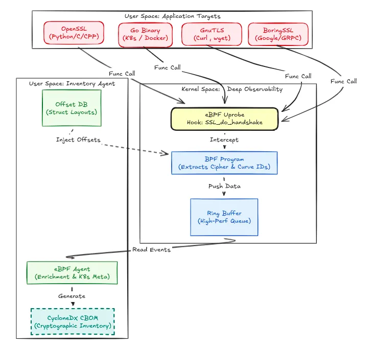

# eBPF CipherTrace (Boilerplate)

eBPF-CipherTrace is an eBPF-based cryptographic observability agent. It intercepts cryptographic handshakes at the uprobe level (OpenSSL, Go, Java) to generate a high-fidelity Cryptographic Bill of Materials (CBOM).

For a detailed deep dive, read the blog post: [eBPF CipherTrace: Cryptographic Visibility for the Quantum Era](https://medium.com/@satyam012005/ebpf-ciphertrace-cryptographic-visibility-for-the-quantum-era-1ca83782054b)

## Architecture



## Structure

- `cmd/agent/`: Main agent entry point.
- `bpf/`: eBPF C source code.
- `pkg/ebpf/`: BPF loader and management.
- `pkg/uprobes/`: Logic for attaching uprobes to cryptographic libraries.
- `pkg/cbom/`: CBOM data models and generation.
- `pkg/metadata/`: Metadata enrichment (Kubernetes/Docker context).

## Prerequisites

- Linux Kernel 5.4+ (with BTF support)
- Go 1.22+
- Clang/LLVM (for BPF compilation)
- libbpf headers

## Building

1.  **Generate BPF artifacts** (Requires `bpf2go`):
    ```bash
    # This is a placeholder command
    # go generate ./...
    ```

2.  **Build Agent**:
    ```bash
    go build -o ebpf-ciphertrace ./cmd/agent
    ```

## Running

```bash
sudo ./ebpf-ciphertrace
```

## Disclaimer

This is a boilerplate implementation. The BPF C code is a skeleton, and the Go loader requires generated artifacts from `bpf2go`.
